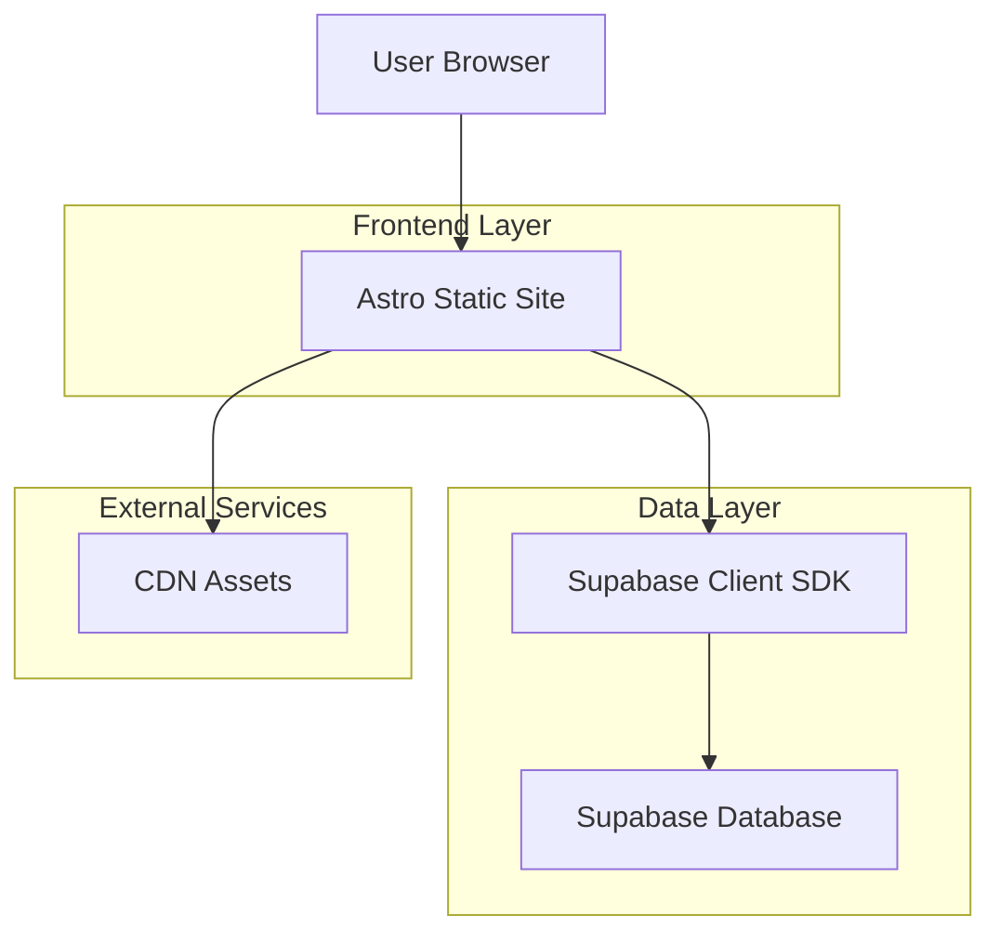
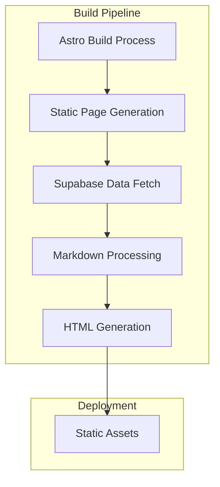
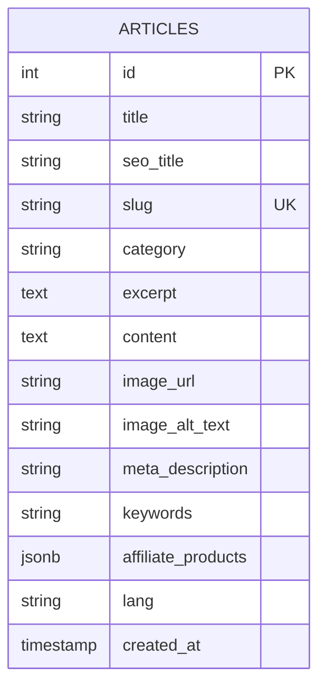

# Technical Architecture Document: High-Performance Static-First Blog

## 1. Architecture Design



## 2. Technology Description

- **Frontend Framework**: Astro@latest + TypeScript
- **Styling**: Tailwind CSS@3 + @tailwindcss/typography plugin
- **Database**: Supabase (PostgreSQL)
- **Markdown Parser**: marked
- **Animations**: GSAP (GreenSock)
- **Initialization Tool**: astro-create

## 3. Route Definitions

| Route | Purpose |
|-------|---------|
| / | Homepage with article listings and hero section |
| /blog/[slug] | Individual article page with full content |
| /category/[category] | Category-based article filtering |
| /about | About page with site information |
| /contact | Contact page with form |
| /sitemap.xml | XML sitemap for SEO |
| /rss.xml | RSS feed for content syndication |

## 4. API Definitions

### 4.1 Core API Types

Article data structure based on database schema:

```typescript
interface Article {
  id: number;
  title: string;
  seo_title: string | null;
  slug: string;
  category: string | null;
  excerpt: string | null;
  content: string; // Markdown content
  image_url: string | null;
  image_alt_text: string | null;
  meta_description: string | null;
  keywords: string | null;
  affiliate_products: AffiliateProduct[];
  lang: string;
  created_at: string;
}

interface AffiliateProduct {
  name: string;
  rating: number;
  pros: string[];
  cons: string[];
  link: string;
}

interface ArticleListItem {
  id: number;
  title: string;
  slug: string;
  category: string | null;
  excerpt: string | null;
  image_url: string | null;
  created_at: string;
}
```

### 4.2 Supabase Operations

```typescript
// Fetch all articles
GET /api/articles
Response: ArticleListItem[]

// Fetch single article by slug
GET /api/articles/[slug]
Response: Article

// Fetch articles by category
GET /api/articles/category/[category]
Response: ArticleListItem[]

// Search articles
GET /api/articles/search?q=[query]
Response: ArticleListItem[]
```

## 5. Server Architecture



## 6. Data Model

### 6.1 Database Schema



### 6.2 Data Definition Language

```sql
-- Create articles table
CREATE TABLE public.articles (
  id SERIAL NOT NULL,
  title TEXT NOT NULL,
  seo_title TEXT NULL,
  slug VARCHAR(255) NOT NULL,
  category VARCHAR(150) NULL,
  excerpt TEXT NULL,
  content TEXT NOT NULL,
  image_url TEXT NULL,
  image_alt_text TEXT NULL,
  meta_description TEXT NULL,
  keywords TEXT NULL,
  affiliate_products JSONB NULL DEFAULT '[]'::JSONB,
  lang VARCHAR(10) NULL DEFAULT 'ar'::VARCHAR,
  created_at TIMESTAMP WITH TIME ZONE NULL DEFAULT CURRENT_TIMESTAMP,
  CONSTRAINT articles_pkey PRIMARY KEY (id),
  CONSTRAINT articles_slug_key UNIQUE (slug)
);

-- Create indexes for performance
CREATE INDEX idx_articles_slug ON articles(slug);
CREATE INDEX idx_articles_category ON articles(category);
CREATE INDEX idx_articles_created_at ON articles(created_at DESC);
CREATE INDEX idx_articles_lang ON articles(lang);

-- Grant permissions
GRANT SELECT ON articles TO anon;
GRANT ALL PRIVILEGES ON articles TO authenticated;

-- Row Level Security (RLS) policies
ALTER TABLE articles ENABLE ROW LEVEL SECURITY;

-- Allow public read access
CREATE POLICY "Allow public read access" ON articles
  FOR SELECT USING (true);
```

### 6.3 TypeScript Type Definitions

```typescript
// Database types for Supabase
export interface Database {
  public: {
    Tables: {
      articles: {
        Row: {
          id: number;
          title: string;
          seo_title: string | null;
          slug: string;
          category: string | null;
          excerpt: string | null;
          content: string;
          image_url: string | null;
          image_alt_text: string | null;
          meta_description: string | null;
          keywords: string | null;
          affiliate_products: AffiliateProduct[];
          lang: string;
          created_at: string;
        };
        Insert: {
          id?: number;
          title: string;
          seo_title?: string | null;
          slug: string;
          category?: string | null;
          excerpt?: string | null;
          content: string;
          image_url?: string | null;
          image_alt_text?: string | null;
          meta_description?: string | null;
          keywords?: string | null;
          affiliate_products?: AffiliateProduct[];
          lang?: string;
          created_at?: string;
        };
        Update: {
          id?: number;
          title?: string;
          seo_title?: string | null;
          slug?: string;
          category?: string | null;
          excerpt?: string | null;
          content?: string;
          image_url?: string | null;
          image_alt_text?: string | null;
          meta_description?: string | null;
          keywords?: string | null;
          affiliate_products?: AffiliateProduct[];
          lang?: string;
          created_at?: string;
        };
      };
    };
  };
}

export interface AffiliateProduct {
  name: string;
  rating: number;
  pros: string[];
  cons: string[];
  link: string;
}
```

## 7. Performance Optimizations

### 7.1 Static Generation Strategy
- Pre-build all article pages at build time
- Implement ISR (Incremental Static Regeneration) for content updates
- Use Astro's partial hydration for interactive components

### 7.2 Asset Optimization
- Implement responsive images with proper srcset
- Lazy load affiliate product images
- Minimize JavaScript bundle size through selective hydration

### 7.3 SEO Optimizations
- Generate dynamic meta tags for each article
- Implement structured data (JSON-LD) for articles
- Create XML sitemap and RSS feed
- Optimize Core Web Vitals (LCP, FID, CLS)

### 7.4 Caching Strategy
- Leverage Astro's built-in caching
- Implement browser caching for static assets
- Use CDN for global content delivery